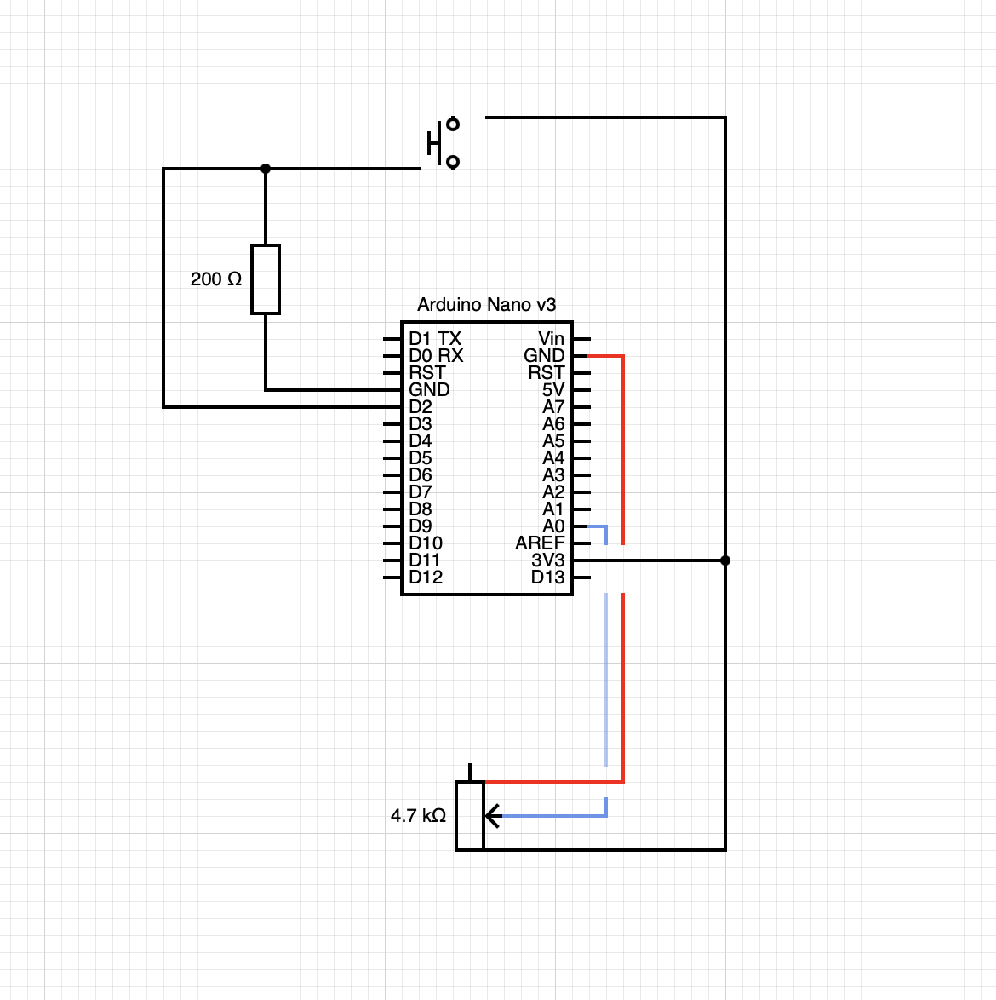

# HW13 Template

I recreated my code from HW04B, which was Wall Drawing #45 (1970): "Straight lines 25 cm long, not touching, covering the wall evenly."

I mapped the potentiometer to the line length so that different values shorten or lengthen the lines. I also included a button which rotates the orientation of the canvas. Although I was able to get the Arduino to connect to the serial monitor I had trouble with certain aspects of the JSON connection and had to ask ChatGPT to help me in order to stop getting syntax errors. I also had my button wired wrong for a long time — I feel like with coding more than most things I have to give myself several days to sleep on a problem and realize what's wrong (in this case, resistor connecting to the wrong pin, oopsie).

